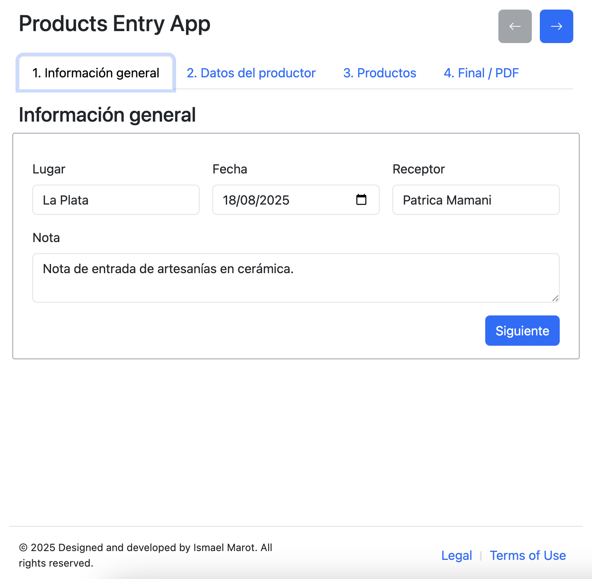
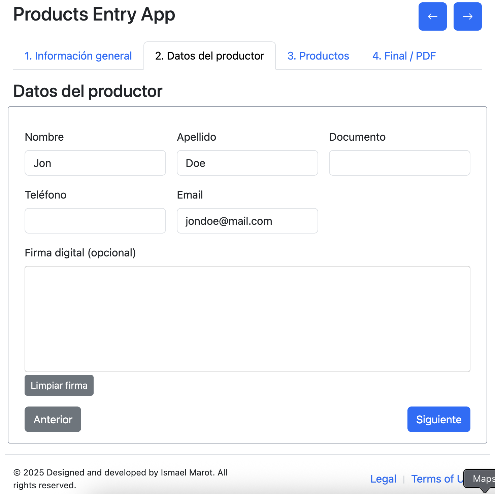
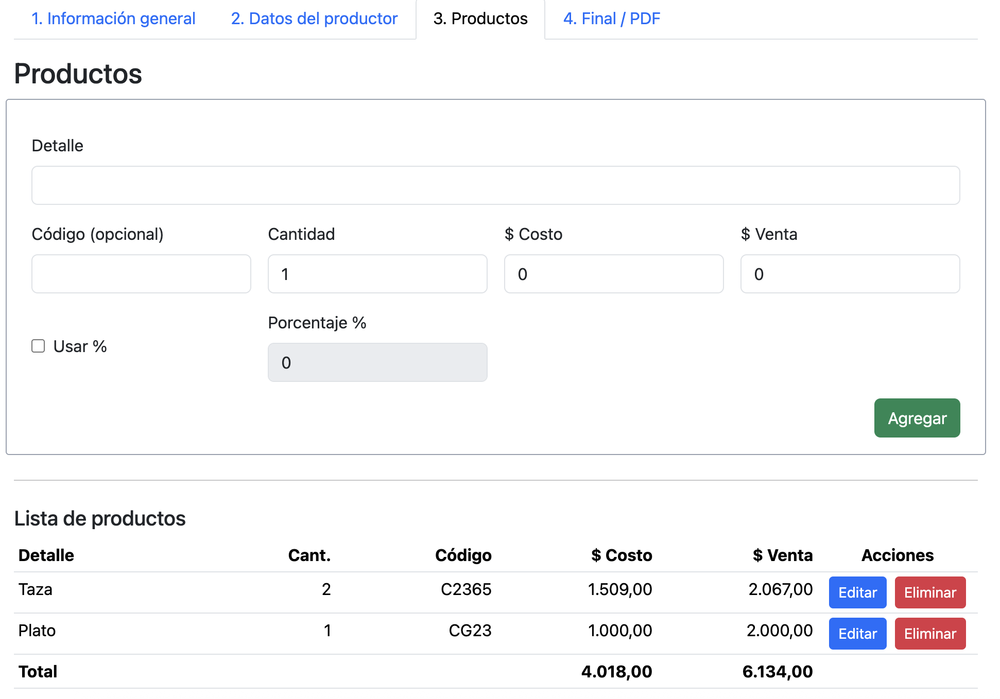
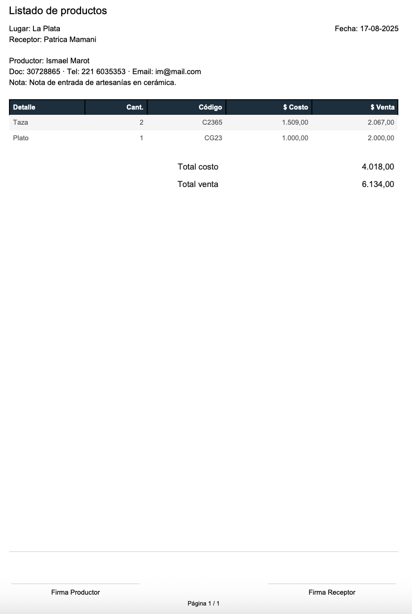

# Product Entry App 🛒

A modern web application built with **React**, **TypeScript**, **Vite**, and **Bootstrap**, designed for managing product entries efficiently.

---
[](https://opensource.org/licenses/MIT)
[](https://nodejs.org/)
[](https://reactjs.org/)
[](https://vitejs.dev/)
---

## Features

1. **📝 General Information Input**  
   Capture essential data: City, Date, Receiver, and other relevant details.

2. **👤 Producer Information**  
   Add personal information of the producer: First Name, Last Name, etc.

3. **📦 Product Management**  
   - Enter product details: Description, Quantity, Cost Price, Sale Price  
   - Dynamically view the list of added products  
   - Edit or remove products individually

4. **🖨️ Final Review & Export**  
   - View the complete product list  
   - Export or print the list as a PDF

---

##🛠 Tech Stack

- **React** – Frontend library for building user interfaces  
- **TypeScript** – Strongly typed JavaScript for safer code  
- **Vite** – Fast development server with Hot Module Replacement  
- **Bootstrap** – Responsive UI components  
- **jsPDF** – PDF generation for export/printing  

---

##🚀 Getting Started

### Prerequisites

- Node.js >= 18.12
- npm or yarn

### Installation
```bash
git clone https://github.com/ismaelmarot/product-entry-app.git
cd product-entry-app
npm install
```

## Running the App
```bash
npm run dev
```
Open your browser at http://localhost:5173

---
### Project Structure
```bash
product-entry-app/
├─ src/
│  ├─ components/     # React components (forms, product list, navigation)
│  ├─ pages/          # Step-by-step pages
│  ├─ context/        # App context for global state
│  ├─ helpers/        # Utility functions
│  └─ App.tsx         # Main app entry
├─ public/            # Static assets
├─ package.json
└─ vite.config.ts
```

---

### 🤝 Contributing
1. Fork the repository

2. Create your feature branch (git checkout -b feature/my-feature)

3. Commit your changes (git commit -m "feat: my new feature")

4. Push to the branch (git push origin feature/my-feature)

5. Open a Pull Request

_Please follow the code style and naming conventions._

---
### 📝 Notes

Make sure Node.js version is compatible (>=18.12)

All added products are stored temporarily in app state

Exported PDFs are generated using jsPDF

---
### 📄 License

This project is licensed under the MIT License.
[](https://opensource.org/licenses/MIT)

---
### 📷 Screenshots










